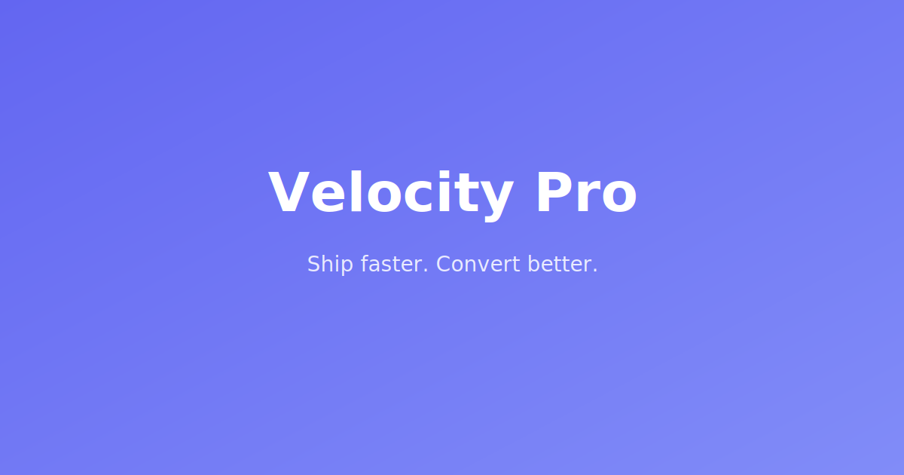

# Velocity Pro

> Ship faster. Convert better. The SaaS template that sells.

A premium, production-ready SaaS marketing template built with **Astro 5**, **React 19**, and **CSS Modules**. 48 components, 12 pages, 3 color themes, dark mode, and buttery-smooth animations — all without Tailwind.



## ✨ Features

- **48 Components** — Navigation, heroes, features, pricing, testimonials, blog, docs, and more
- **12 Pages** — Home, Features, Pricing, About, Contact, FAQ, Blog, Case Studies, Changelog, Docs, Login, Signup
- **3 Color Themes** — Indigo Night, Ocean Teal, Sunset Coral (swap with one attribute)
- **Dark Mode** — Full light/dark toggle with localStorage persistence
- **Blog System** — MDX content collections with 3 post layouts (standard, wide, minimal)
- **Documentation** — Searchable docs with collapsible sidebar navigation
- **View Transitions** — Smooth page transitions via Astro View Transitions API
- **Micro-Animations** — Scroll-triggered entrances, count-up numbers, hover effects
- **Lighthouse 90+** — Performance, Accessibility, Best Practices, SEO
- **Zero Tailwind** — Pure CSS Modules + CSS Custom Properties
- **TypeScript** — Strict mode throughout
- **SEO Ready** — Open Graph, Twitter cards, sitemap, robots.txt

## 🚀 Quick Start

```bash
# Clone and install
git clone <your-repo-url> my-saas
cd my-saas
npm install

# Start development
npm run dev
```

Open [http://localhost:4321](http://localhost:4321) to see your site.

## 📁 Project Structure

```
src/
├── components/    # 48 React + Astro components
├── content/       # MDX collections (blog, docs, changelog, case studies)
├── data/          # Static data (navigation, pricing, team, etc.)
├── hooks/         # React hooks (useInView, useTheme, useCountUp)
├── layouts/       # 5 page layouts
├── pages/         # 12 file-based routes
├── styles/        # Global CSS, themes, prose styles
└── utils/         # Helper functions
```

## 🎨 Theme Switching

Velocity Pro ships with 3 color themes. Switch by changing the `data-color` attribute:

```html
<!-- In BaseLayout.astro -->
<html data-theme="light" data-color="indigo">  <!-- Default -->
<html data-theme="light" data-color="teal">    <!-- Ocean Teal -->
<html data-theme="light" data-color="coral">   <!-- Sunset Coral -->
```

### Dark Mode

Dark mode toggles automatically via the ThemeToggle component. It persists the user's preference to `localStorage`.

To set the default to dark:

```html
<html data-theme="dark" data-color="indigo">
```

## 📝 Content Management

### Blog Posts

Add new posts in `src/content/blog/`:

```mdx
---
title: "Your Post Title"
description: "A brief description"
pubDate: 2026-01-15
category: "Engineering"
layout: "standard"  # standard | wide | minimal
heroImage: "/images/blog/cover-1.svg"
---

Your MDX content here...
```

### Documentation

Add docs in `src/content/docs/`:

```mdx
---
title: "Page Title"
description: "Page description"
order: 1
section: "Getting Started"
---

Content...
```

### Changelog

Add entries in `src/content/changelog/`:

```mdx
---
title: "What's New"
version: "1.2.0"
date: 2026-01-15
type: "minor"  # major | minor | patch
---

- Added new feature
- Fixed bug
```

## 🏗️ Customization

See [CUSTOMIZATION.md](CUSTOMIZATION.md) for a detailed guide covering:

- Creating custom color themes
- Modifying typography
- Adding/removing pages
- Customizing components
- Changing animations

## 🚢 Deployment

### GitHub Pages

1. Update `site` and `base` in `astro.config.mjs`
2. Push to GitHub — the included workflow deploys automatically

### Vercel

1. Connect your repo at [vercel.com/new](https://vercel.com/new)
2. Vercel auto-detects Astro — click Deploy

### Netlify

1. Connect your repo at [app.netlify.com](https://app.netlify.com)
2. Build command: `npm run build`
3. Publish directory: `dist`

## 📦 Scripts

| Command | Description |
|---------|-------------|
| `npm run dev` | Development server (port 4321) |
| `npm run build` | Production build |
| `npm run preview` | Preview production build |

## 🛠️ Tech Stack

| Layer | Technology |
|-------|-----------|
| Framework | Astro 5 |
| UI Islands | React 19 |
| Language | TypeScript (strict) |
| Styling | CSS Modules |
| Content | Astro Content Collections (MDX) |
| Animations | CSS @keyframes + Intersection Observer |
| Icons | Lucide React |
| Transitions | Astro View Transitions API |

## 📄 License

MIT — use it for personal and commercial projects.
